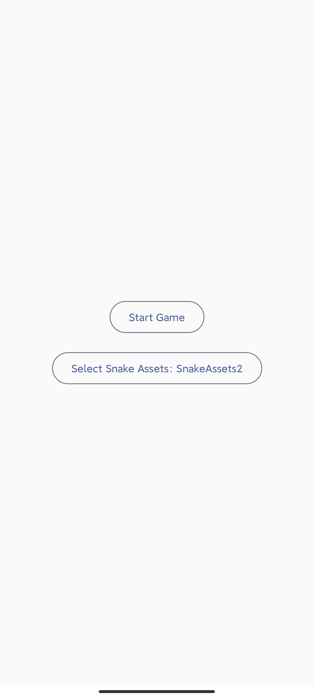
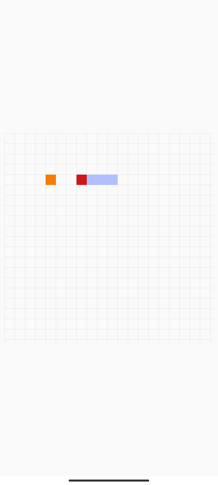

# Jetpack Compose 贪吃蛇
基于 Jetpack Compose 框架，采用 MVI 架构实现的贪吃蛇游戏。
点此下载：[app-debug.apk](app-debug.apk)

|  |  |
| ------------------------------- | ------------------------------ |


## 环境

- Gradle 8.0，**这需要 Java17 及以上版本**
- Jetpack Compose BOM: 2023.03.00
- Compose 编译器版本：1.4.0


## MVI

MVI 是 Model-View-Intent 的缩写，是一种架构模式，它的核心思想是将 UI 的状态抽象为一个单一的数据流，这个数据流由 View 发出的 Intent 作为输入，经过 Model 处理后，再由 View 显示出来。
具体到本项目，View 是贪吃蛇的游戏界面，Model 是游戏的逻辑，Intent 是用户和系统的操作，比如开始游戏、更改方向等。

- **View层**：基于 Compose 打造，所有 UI 元素都由代码实现 
- **Model层**：ViewModel 维护 State 的变化，游戏逻辑交由 reduce 处理 
- **V-M通信**：通过 State 驱动 Compose 刷新，事件由 Action 分发至 ViewModel

ViewModel 基本结构如下：

```kotlin
class SnakeGameViewModel : ViewModel() {
    val snakeState = mutableStateOf(
        SnakeState(
            snake = INITIAL_SNAKE,
            size = 400 to 400,
            blockSize = Size(20f, 20f),
            food = generateFood(INITIAL_SNAKE.body)
        )
    )

    fun dispatch(gameAction: GameAction) {
        snakeState.value = reduce(snakeState.value, gameAction)
    }

    private fun reduce(state: SnakeState, gameAction: GameAction): SnakeState {
        val snake = state.snake
        return when (gameAction) {
            GameAction.GameTick -> state.copy(/*...*/)
            GameAction.StartGame -> state.copy(gameState = GameState.PLAYING)
            //  ...
        }
    }
}
```

完整代码见：[SnakeGameViewModel.kt](app/src/main/java/com/funny/compose/snake/ui/SnakeGameViewModel.kt)


## UI
由于代码的逻辑均交给了 ViewModel，所以 UI 层的代码量非常少，只需要关注 UI 的展示即可。

```kotlin
@Composable
fun ColumnScope.Playing(
    snakeState: SnakeState,
    snakeAssets: SnakeAssets,
    dispatchAction: (GameAction) -> Unit
) {
    Canvas(
        modifier = Modifier
            .fillMaxSize()
            .square()
            .onGloballyPositioned {
                val size = it.size
                dispatchAction(GameAction.ChangeSize(size.width to size.height))
            }
            .detectDirectionalMove {
                dispatchAction(GameAction.MoveSnake(it))
            }
    ) {
        drawBackgroundGrid(snakeState, snakeAssets)
        drawSnake(snakeState, snakeAssets)
        drawFood(snakeState, snakeAssets)
    }
}
```

上面的代码使用 `Canvas` 作为画布，通过 `square` 修饰符使其长宽相等，通过 `drawBackgroundGrid`、`drawSnake`、`drawFood` 绘制游戏的背景、蛇和食物。
完整代码见：[SnakeGame.kt](app/src/main/java/com/funny/compose/snake/ui/SnakeGame.kt)


## 主题
本项目自带了一个简单的主题示例，设置不同的主题可以更改蛇的颜色、食物的颜色等

 

|  |  |
| ---------------------------- | ---------------------------- |

主题功能的实现基于 `CompositionLocal`，具体介绍可以参考 [官方文档：使用 CompositionLocal 将数据的作用域限定在局部 ](https://developer.android.google.cn/jetpack/compose/compositionlocal?hl=zh-cn)。简单来说，父 Composable 使用它，所有子 Composable 中都能获取到对应值，我们所熟悉的 `MaterialTheme` 就是通过它实现的

### 定义类

我们先定义一个密闭类，表示我们的主题

```kotlin
sealed class SnakeAssets(
    val foodColor: Color= MaterialColors.Orange700,
    val lineColor: Color= Color.LightGray.copy(alpha = 0.8f),
    val headColor: Color= MaterialColors.Red700,
    val bodyColor: Color= MaterialColors.Blue200
) {
    object SnakeAssets1: SnakeAssets()

    object SnakeAssets2: SnakeAssets(
        foodColor = MaterialColors.Purple700,
        lineColor = MaterialColors.Brown200.copy(alpha = 0.8f),
        headColor = MaterialColors.Blue700,
        bodyColor = MaterialColors.Pink300
    )
}
```

上面的 `MaterialColors` 来自库 [FunnySaltyFish/CMaterialColors： 在 Jetpack Compose 中使用 Material Design Color](https://github.com/FunnySaltyFish/CMaterialColors)

### 使用

通过 `provide` 中缀函数指定我们的 Assets

```kotlin
internal val LocalSnakeAssets: ProvidableCompositionLocal<SnakeAssets> = staticCompositionLocalOf { SnakeAssets.SnakeAssets1 }

// ....

val snakeAssets by ThemeConfig.savedSnakeAssets
CompositionLocalProvider(LocalSnakeAssets provides snakeAssets) {
    SnakeGame()
}
```

只需要改变 `ThemeConfig.savedSnakeAssets` 的值，即可全局更改主题样式啦

### 保存配置到本地（持久化）

我们希望用户选择的主题能在下一次打开应用时仍然生效，因此可以把它保存到本地。这里借助的是开源库 [FunnySaltyFish/ComposeDataSaver: 在Jetpack Compose中优雅完成数据持久化](https://github.com/FunnySaltyFish/ComposeDataSaver)。通过它，可以用类似于 `rememberState` 的方式轻松做到这一点

由于要保存 `SnakeAssets` 这个自定义类型，我们需要提前注册下类型转换器。

```kotlin
class App: Application() {
    override fun onCreate() {
        super.onCreate()
        DataSaverUtils = DataSaverPreferences(this)

        // SnakeAssets 使我们自定义的类型，因此先注册一下转换器，能让它保存时自动转化为 String，读取时自动从 String 恢复成 SnakeAssets
        DataSaverConverter.registerTypeConverters(save = SnakeAssets.Saver, restore = SnakeAssets.Restorer)
    }

    companion object {
        lateinit var DataSaverUtils: DataSaverInterface
    }
}
```

然后在 `ThemeConfig` 中创建一个 `DataSaverState` 即可

```
val savedSnakeAssets: MutableState<SnakeAssets> = mutableDataSaverStateOf(DataSaverUtils ,key = "saved_snake_assets", initialValue = SnakeAssets.SnakeAssets1)
```

之后，对 `savedSnakeAssets` 的赋值都会自动触发 `异步的持久化操作`，下次打开应用时也会自动读取。


## 其他

其实这个项目最早创建于 2022-02 ，作为学习 Compose MVI 的项目。但鉴于当时对 Compose 不那么熟练，写着写着放弃了；直到 2023-03-31，我在整理 [FunnySaltyFish/JetpackComposeStudy: 本人 Jetpack Compose 主题文章所包含的示例，包括自定义布局、部分组件用法等 ](https://github.com/FunnySaltyFish/JetpackComposeStudy) 项目时又翻到了这个被我遗忘多时的老项目，于是一时兴起，花了两三个小时把它完成了，并写下了这个 README。或许对后人有些参考？

项目还附带了一份 Python 的 Pygame 实现的版本，见 `python_version` 文件夹，运行 `main.py` 即可


## 参考

- [爷童回！Compose + MVI 打造经典版的俄罗斯方块 - 掘金 (juejin.cn)](https://juejin.cn/post/6950196093367877663)
- [100 行写一个 Compose 版华容道 - 掘金 (juejin.cn)](https://juejin.cn/post/7000908871292157989)