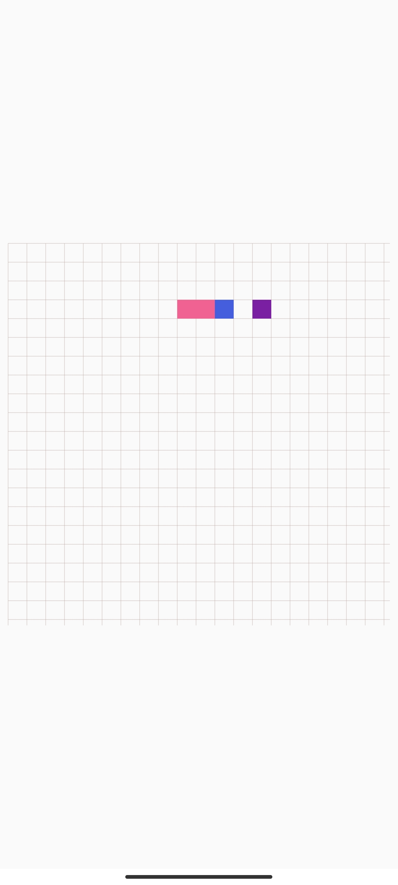

# Jetpack Compose Snake Game
> The English version is translated from [Chinese Version](README_CN.md) with ChatGPT. Thanks for its amazing performance!

A snake game implemented using the Jetpack Compose framework and the MVI architecture.

Download link: [app-debug.apk](app-debug.apk)

|  |  |
| ------------------------------- | ------------------------------ |

https://user-images.githubusercontent.com/46063434/229269027-58e2d941-01be-4c52-a7dc-92213e13c0aa.mp4


## Environment

- Gradle 8.0, **requires Java 17 or higher**
- Jetpack Compose BOM: 2023.03.00
- Compose Compiler version: 1.4.0

## MVI


MVI stands for Model-View-Intent, which is an architecture pattern that abstracts the UI state as a single data flow. This data flow is driven by the intents sent by the View, processed by the Model, and then displayed by the View again.

In this project, the View is the game interface, the Model is the game logic, and the Intent is the user and system operations, such as starting the game and changing direction.

- **View layer**: built with Compose, all UI elements are implemented in code
- **Model layer**: ViewModel maintains the changes of State, and the game logic is handled by reduce
- **V-M communication**: Compose is refreshed by State, and events are dispatched to ViewModel by Action

The basic structure of the ViewModel is as follows: 

```kotlin
class SnakeGameViewModel : ViewModel() {
    val snakeState = mutableStateOf(
        SnakeState(
            snake = INITIAL_SNAKE,
            size = 400 to 400,
            blockSize = Size(20f, 20f),
            food = generateFood(INITIAL_SNAKE.body)
        )
    )

    fun dispatch(gameAction: GameAction) {
        snakeState.value = reduce(snakeState.value, gameAction)
    }

    private fun reduce(state: SnakeState, gameAction: GameAction): SnakeState {
        val snake = state.snake
        return when (gameAction) {
            GameAction.GameTick -> state.copy(/*...*/)
            GameAction.StartGame -> state.copy(gameState = GameState.PLAYING)
            //  ...
        }
    }
}
```

Check the full code: [SnakeGameViewModel.kt](app/src/main/java/com/funny/compose/snake/ui/SnakeGameViewModel.kt)


## UI
Since the logic of the code is handed over to the ViewModel, the amount of code in the UI layer is very small, and only the UI presentation needs to be concerned.

```kotlin
@Composable
fun ColumnScope.Playing(
    snakeState: SnakeState,
    snakeAssets: SnakeAssets,
    dispatchAction: (GameAction) -> Unit
) {
    Canvas(
        modifier = Modifier
            .fillMaxSize()
            .square()
            .onGloballyPositioned {
                val size = it.size
                dispatchAction(GameAction.ChangeSize(size.width to size.height))
            }
            .detectDirectionalMove {
                dispatchAction(GameAction.MoveSnake(it))
            }
    ) {
        drawBackgroundGrid(snakeState, snakeAssets)
        drawSnake(snakeState, snakeAssets)
        drawFood(snakeState, snakeAssets)
    }
}
```

The above code uses `Canvas` as the canvas, and uses the `square` modifier to make it equal in length and width. It draws the game's background, snake, and food through `drawBackgroundGrid`, `drawSnake`, and `drawFood`, respectively. The complete code can be found in [SnakeGame.kt](app/src/main/java/com/funny/compose/snake/ui/SnakeGame.kt).

## Themes
This project comes with a simple theme example. Setting different themes can change the color of the snake, food, etc.

|  |  |
| ---------------------------- | ---------------------------- |

The implementation of the theme function is based on `CompositionLocal`, which can be referred to in detail in the [official documentation: Use CompositionLocal to limit the scope of data locally](https://developer.android.com/jetpack/compose/compositionlocal?hl=en). In short, it is used by the parent Composable, and all child Composables can obtain the corresponding value. The `MaterialTheme` we are familiar with is implemented through it.

### Define the class

We first define a sealed class to represent our theme.

```kotlin
sealed class SnakeAssets(
    val foodColor: Color= MaterialColors.Orange700,
    val lineColor: Color= Color.LightGray.copy(alpha = 0.8f),
    val headColor: Color= MaterialColors.Red700,
    val bodyColor: Color= MaterialColors.Blue200
) {
    object SnakeAssets1: SnakeAssets()

    object SnakeAssets2: SnakeAssets(
        foodColor = MaterialColors.Purple700,
        lineColor = MaterialColors.Brown200.copy(alpha = 0.8f),
        headColor = MaterialColors.Blue700,
        bodyColor = MaterialColors.Pink300
    )
}
```

The `MaterialColors` used above comes from the library [FunnySaltyFish/CMaterialColors: Use Material Design Color in Jetpack Compose](https://github.com/FunnySaltyFish/CMaterialColors).

### Usage

Specify our Assets through the `provide` infix function.

```kotlin
internal val LocalSnakeAssets: ProvidableCompositionLocal<SnakeAssets> = staticCompositionLocalOf { SnakeAssets.SnakeAssets1 }

// ....

val snakeAssets by ThemeConfig.savedSnakeAssets
CompositionLocalProvider(LocalSnakeAssets provides snakeAssets) {
    SnakeGame()
}
```

Simply change the value of `ThemeConfig.savedSnakeAssets` to change the global theme style.

### Save configuration to local (persistence)

We hope that the theme selected by the user can still take effect the next time the application is opened, so we can save it to the local. Here, we use the open source library [FunnySaltyFish/ComposeDataSaver: Elegant data persistence in Jetpack Compose](https://github.com/FunnySaltyFish/ComposeDataSaver). Through it, we can easily achieve this in a way similar to `rememberState`.

Since we need to save the custom type `SnakeAssets`, we need to register the type converter in advance.

```kotlin
class App: Application() {
    override fun onCreate() {
        super.onCreate()
        DataSaverUtils = DataSaverPreferences(this)

        // SnakeAssets is our custom type, so register the converter in advance, which can automatically convert it to String when saving and restore it from String when reading.
        DataSaverConverter.registerTypeConverters(save = SnakeAssets.Saver, restore = SnakeAssets.Restorer)
    }

    companion object {
        lateinit var DataSaverUtils: DataSaverInterface
    }
}
```

Then create a `DataSaverState` in `ThemeConfig`.

```
val savedSnakeAssets: MutableState<SnakeAssets> = mutableDataSaverStateOf(DataSaverUtils ,key = "saved_snake_assets", initialValue = SnakeAssets.SnakeAssets1)
```

Afterwards, any assignment to `savedSnakeAssets` will automatically trigger an `asynchronous persistence operation`, and it will also be automatically read the next time the application is opened.

## Other

In fact, this project was originally created in February 2022 as a project to learn Compose MVI. However, due to my lack of proficiency in Compose at the time, I gave up writing it. Until March 31, 2023, when I was organizing the [FunnySaltyFish/JetpackComposeStudy: My Jetpack Compose theme article contains examples, including custom layouts, some component usage, etc.](https://github.com/FunnySaltyFish/JetpackComposeStudy) project, I stumbled upon this long-forgotten old project and impulsively spent two or three hours completing it and writing this README. Perhaps it can be a reference for future generations?

The project also comes with a Python implementation using Pygame, see the `python_version` folder, and run `main.py` to start.

## References

- [Compose + MVI to create a classic version of Tetris - 掘金 (juejin.cn)](https://juejin.cn/post/6950196093367877663)
- [100 lines to write a Compose version of Huarongdao - 掘金 (juejin.cn)](https://juejin.cn/post/7000908871292157989)

